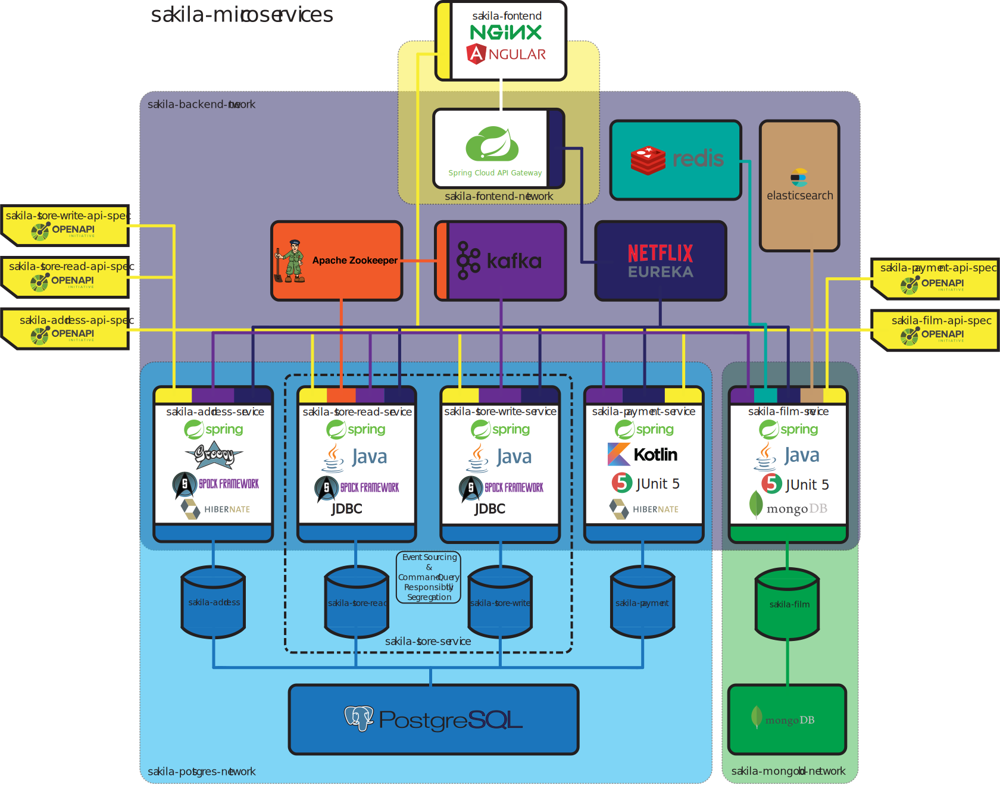

# sakila-microservices

A polyglot microservice system in the `JVM` language family based on the `sakila` database
ported to `PostgreSQL` and `MongoDB`.

## Architecture

The original database is split into 5 separate databases:

 - `sakila_address`
 - `sakila_store_write`
 - `sakila_store_read`
 - `sakila_payment`
 - `sakila_film`

Each database is completely managed by a microservice. The separate services communicate
with each other by broadcasting and consuming messages when data change events occur. Each
service exposes its data through a RESTful API. Requests are routed to the microservices using
an API gateway. A browser client consumes the composite API and visualises the data in
different views.

The system is horizontally scalable and the instances of a microservice register themselves
into the system using a discovery service. Requests to a given service are load-balanced
between the registered instances. Scheduled task execution is based on leader election
between the instances.

Each component is packaged into a container. Components are isolated using networks for the
different database servers, the microservice layer and the gateway component, where a
component is given access only to the networks which contain the services it requires to
function.

Each of the microservices follows a MVC CRUD design, with the exception of the
(`sakila-store-write-service`, `sakila-store-read-service`) which combined together form the
"logical" store service using event sourcing and command-query responsibility segregation.
Here the `sakila_store_write` database acts as the event store, and the `sakila_store_read`
contains the resulting models.

## Technology stack

| service                    | application framework | language | testing framework | database connection  |
| -------------------------- |:---------------------:|:--------:|:-----------------:|:--------------------:|
| sakila-address-service     | `Spring Boot`         | `Groovy` | `Spock Framework` | `Hibernate`          |
| sakila-store-read-service  | `Spring Boot`         | `Java`   | `Spock Framework` | `JDBC`               |
| sakila-store-write-service | `Spring Boot`         | `Java`   | `Spock Framework` | `JDBC`               |
| sakila-payment-service     | `Spring Boot`         | `Kotlin` | `JUnit 5`         | `Hibernate`          |
| sakila-film-service        | `Spring Boot`         | `Java`   | `JUnit 5`         | `MongoDB Java Driver`|

The microservices are written in the JVM language family (`Java`, `Groovy`, `Kotlin`) with each
service utilising 1 language for the main/test sources respectively. The common application
framework for all of the services is `Spring Boot`. Automated testing is done using either
`JUnit 5` or the `Spock Framework`.

The database layer of the system is composed of 1 `PostgreSQL` server and 1 `MongoDB` server.
Each database is versioned by its respective microservice using a database migration tool -
`Flyway` for `PostgreSQL` database and a custom migration tool implementation for the
`MongoDB` database. The services are connected to the `PostgreSQL` databases using either `JDBC`
or an ORM (`Hibernate`). The connection to the `MongoDB` database is made using the `MondgoDB`
java driver.

The REST api of each of the microservices is defined in an external `OpenAPI v2.0`
specification, which is used to generate the server/client code in the backend/frontend.

The services publish and consume data change events through `Kafka` streams. The accompanied
`ZooKeeper` service is also used for leader election for scheduled task execution, this is done
using the `Apache Curator` library. Each service has a custom event bus implementation which is
used to asynchronously publish data change events internally, which are then published to the
`Kafka` streams.

The sakila-film-service uses Redis for caching responses to film data requests. It also maintains
a search index of film data on an Elastic Search server, which is used to perform film queries coming
from the frontend.

Service discovery is handled by `Spring Cloud Netflix Eureka`, where the system has 1 server
and the separate services are clients. Instances of the microservices bind to a random port and
requests are load-balanced and routed to a given instance
through a `Spring Cloud Gateway` instance.

The frontend client uses `Angular 8` and the compiled application is served using `nginx`.
The client code which consumes the composite API is generated using the `ng-swagger-gen`
module.

`Gradle` is used to build all the components of the system. Each component is packaged into a
Docker container, with this is integrated into the build process.
The different networks are defined in the `docker-compose` configuration, which is also used
to start/stop the system.
Generated sources based on the `OpenAPI` specifications are generated using the
`swagger-codegen` plugin.

Configurations for `Kubernetes` resources are also defined for each component of the system.

## How to run

Prerequisites to build & run the system are:
 - `JRE` version between 1.8 and 19
 - running `Docker` daemon / local Kubernetes cluster
 - `docker-compose`

1 - Build the system & docker images

`./gradlew buildDockerImage`

3 - Start the system

- either through docker-compose: `docker-compose up`
- or on a local Kubernetes cluster by running the deployment script: `./kubernetes-deploy` -> this deploys all
the components' kubernetes resources using `kubectl`

4 - Open the browser client

Visit `http://localhost:30080/index.html` in your browser

## TODO

 - Increase test coverage
 - Consume full API from the browser client
