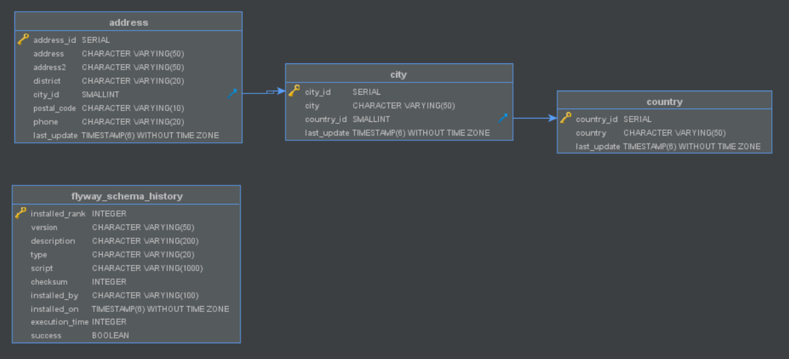

# sakila-address-service

The address microservice which is part of the `sakila-microservices` system. This service manages the
`sakila_address` database and exposes the data through a RESTful API and publishes data change events
to `Kafka` streams.

## Structure

```
src
├── main
│   ├── java
│   │   └── com
│   │       └── example
│   │           └── sakila
│   │               ├── application          ## Main class
│   │               ├── config               ## JPA, Kafka, Cors, EventBus beans
│   │               ├── discovery            ## Registered instances controller
│   │               ├── event
│   │               │   └── bus              ## Custom event bus implementation
│   │               ├── exception            ## Custom exceptions and @ControllerAdvice exception handlers
│   │               └── module
│   │                   ├── address          ## Address model, service, controller
│   │                   │   ├── event        ## Address event publishing
│   │                   │   │   └── model    ## Address event models
│   │                   │   └── repository   ## Address repository interface & implementation
│   │                   ├── city             ## City model, service, controller
│   │                   │   ├── event        ## City event publishing
│   │                   │   │   └── model    ## City event models
│   │                   │   └── repository   ## City epository interface & implementation
│   │                   └── country          ## Country model, service, controller
│   │                       ├── event        ## Country event publishing
│   │                       │   └── model    ## Coutry event models
│   │                       └── repository   ## Country repository interface & implementation
│   └── resources                            ## Application property files
│       └── db
│           └── migration                    ## Database migration files
└── test
    └── java
        └── com
            └── example
                └── sakila
                    └── module
                        ├── address         ## Address service & controller tests
                        ├── city            ## City service & controller tests
                        └── country         ## Country service & controller tests
```

#### Database schema



## Technology stack

The application is based on `Spring Boot`, written in `Groovy`. Testing is also done with `Groovy`
and the `Spock Framework`. The connection to the database is managed with the `Hibernate` ORM.

The API code is generated using the `swagger-codegen-maven-plugin`. The connection to the `Kafka`
cluster is done using `spring-kafka`.

The services is horizontally scalable, with instances registering themselves in the `Eureka` cluster
using the `spring-netflix-eureka-client`.

The database schema is wholly managed by the service using `Flyway`. For each of the tables there is
also a script which writes the initial state.

The service can be built using gradle:
`./gradlew build`

## Environment

The service is packaged into a `Docker` container using the Dockerfile in the root dir, which is used
to build an image on top of `alpine:3.17` with a custom linked JRE.

## Kubernetes deployment

To create a Kubernetes deployment and service run:
`kubectl apply -f ./kubernetes`
