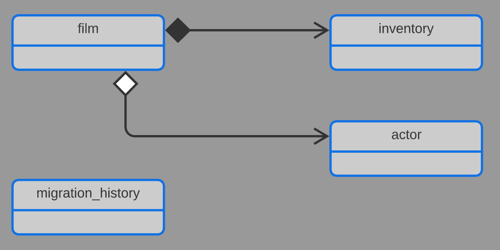

# sakila-film-service

The film microservice which is part of the `sakila-microservices`. This service manages the
`sakila_film` database and exposes the data through a RESTful API and publishes data change
events to `Kafka` streams

## Structure

```
.
├── main
│   ├── java
│   │   └── com
│   │       └── example
│   │           └── sakila
│   │               ├── application          ## Application entrypoint
│   │               ├── config               ## MongoDB, Kafka, Cors, EventBus config
│   │               ├── data
│   │               │   └── migration
│   │               │       └── mongodb      ## Custom MongoDB migration tool
│   │               │           └── model    ## MongoDB migration file models
│   │               ├── discovery            ## Registered instances controller
│   │               ├── event
│   │               │   ├── bus              ## Custom event bus implementation
│   │               │   └── external
│   │               │       └── rental       ## Rental event consumers
│   │               │           └── model    ## Rental event models
│   │               ├── exception            ## Custom exceptions and @ControllerAdvice exception handlers
│   │               └── module
│   │                   ├── actor            ## Actor model, service, controller
│   │                   │   ├── event        ## Actor event publishing
│   │                   │   │   └── model    ## Actor event models
│   │                   │   └── repository   ## Actor repository interface & implementation
│   │                   └── film             ## Film model, service, controller
│   │                       ├── event        ## Film event publishing
│   │                       │   └── model    ## Film event models
│   │                       └── repository   ## Film respository interface & implementation
│   └── resources                            ## Application property files
│       └── mongodb
│           └── scripts                      ## Migration scripts (JSON files)
└── test
    └── java
        └── com
            └── example
                └── sakila
                    └── module
                        ├── actor           ## Actor service tests
                        └── film            ## Film service tests
```

#### Database structure



## Technology stack

The application is based on `Spring Boot`, written in `Java`. Testing is done with the `JUnit 5`
framework. The connection to the database is done with the `MongoDB Java Driver`.

The API code is generated using the `swagger-codegen-maven-plugin` The connection to the `Kafka`
custer is done using `spring-kafka`.

The service is horizontally scalable, with the instances registering themselves to the `Eureka`
cluster using the `spring-netflix-eureka-client`.

The collections in the database are wholly managed by the service. This is done by a custom
migration tool implementation. This tool can create collections with indices and write data into
collections based on predefined json files. After applying the changes defined in a file, the
checksum of its contents is persisted into the database, and later used to ensure that the
changes are applied only once and they are not changed afterwards.

The service is connected to a Redis server which is used for caching responses to film related
requests. The integration with Redis is done using `spring-data-redis`.

The service also maintains a search index of a minimal projection of the film data on an Elastic
Search node. Integration is done using the `Elastic Search Java API Client 8.6`.

The service can be built using gradle:
`./gradlew build`

## Environment

The service is packaged into a `Docker` container using the Dockerfile in the root dir, which is used
to build an image on top of `alpine:3.17` with a custom linked JRE.

## Kubernetes deployment

To create a Kubernetes deployment and service run:
`kubectl apply -f ./kubernetes`
