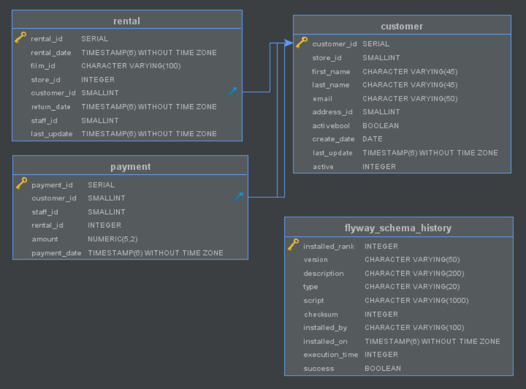

# sakila-payment-service

The payment microservice which is part of the `sakila-microservices` system. This service manages the
`sakila_payment` database and exposes the data through a RESTful API and publishes data change events
to `Kafka` streams.

## Structure

```
.
├── main
│   ├── java
│   │   └── com
│   │       └── example
│   │           └── sakila
│   │               ├── application          ## Application entrypoint
│   │               ├── config               ## JPA, Kafka, Cors, EventBus config
│   │               ├── discovery            ## Registered instances controller
│   │               ├── event
│   │               │   └── bus              ## Custom event bus implementation
│   │               ├── exception            ## Custom exceptions and @ControllerAdvice excpetion handlers
│   │               └── module
│   │                   ├── customer         ## Customer model, service & controller
│   │                   │   ├── event        ## Customer event publishing
│   │                   │   │   └── model    ## Customer event models
│   │                   │   └── repository   ## Customer repository intrface & implementation
│   │                   ├── payment          ## Payment model, service & controller
│   │                   │   ├── event        ## Payment event publishing
│   │                   │   │   └── model    ## Payment event models
│   │                   │   └── repository   ## Payment repository interface & implementation
│   │                   └── rental           ## Rental model, servie & controller
│   │                       ├── event        ## Rental event publishing
│   │                       │   └── model    ## Rental event models
│   │                       └── repository   ## Rental repository interface & implementation
│   └── resources                            ## Application property files
│       └── db
│           └── migration                    ## Database migrations
└── test
    └── java
        └── com
            └── example
                └── sakila
                    └── module
                        ├── customer         ## Customer service tests
                        ├── payment          ## Payment service & controller tests
                        └── rental           ## Rental service & controller tests
```

#### Database schema



## Technology stack

The application is based on `Spring Boot`, written in `Kotlin`. Testing is done with the `JUnit 5` 
framework. The connection to the database is managed with the `Hibernate` ORM.

The API code is generated using the `swagger-codegen-maven-plugin`. The connection to the `Kafka`
cluster is done using `spring-kafka`.

The services is horizontally scalable, with instances registering themselves in the `Eureka` cluster
using the `spring-netflix-eureka-client`.

The database schema is wholly managed by the service using `Flyway`. For each of the tables there is
also a script which writes the initial state.

The build process is managed through `maven`

## Environment

The service is packaged into a `Docker` container using the Dockerfile in the root dir, which is used
to build an image on top of `openjdk:8-jre-alpine`.

