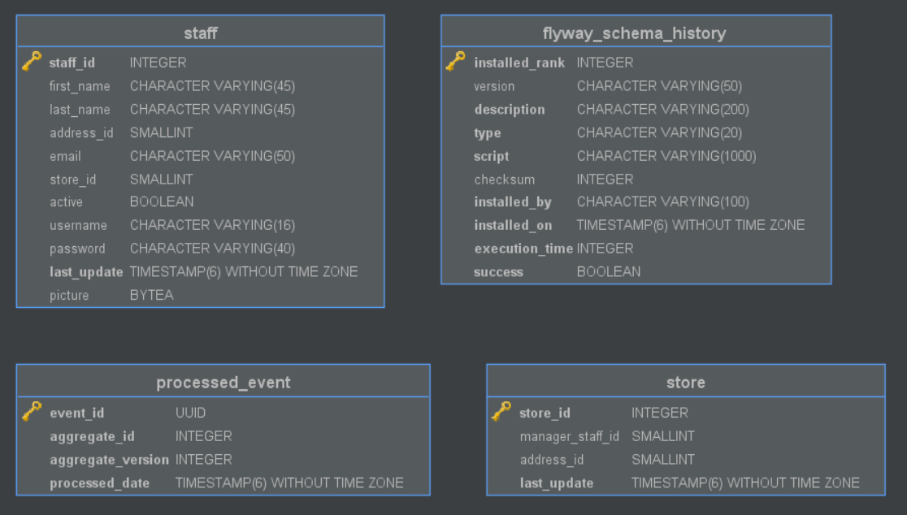

# sakila-store-read-service

The store-read microservice which is part of the `sakila-microservices` system. This service
manages the `sakila_store_read` database and exposes the data through a RESTful API and publishes
data change events to `Kafka` streams.

This is the read component of the logical "sakila-store-service". While this application manages
the data in the `sakila_store_read` database, the API specification does not have any write
operations. Writes to the database are done only when consuming event messages coming from the
`sakila-store-write-service` topics.

The application has a heartbeat mechanism which broadcasts the latest applied event ID.
The application is horizontally scalable, which means that for the scheduled tasks a leader
is elected among the registered instances.

## Structure

```
.
├── main
│   ├── java
│   │   └── com
│   │       └── example
│   │           └── sakila
│   │               ├── application          ## Application entrypoint
│   │               ├── choreography         ## Leader election service
│   │               ├── config               ## Cors, Kafka, TaskScheduler, Zookeeper config
│   │               ├── data                 ## Heartbeat publishing of latest event id
│   │               │   ├── event            ## ProcessedEvent service, repository interface & implementation
│   │               │   ├── staff            ## Staff event models, consumers
│   │               │   └── store            ## Sotre event models, consumers
│   │               ├── discovery            ## Registered services controller
│   │               ├── exception            ## Custom exceptions and @ControllerAdvice exception handlers
│   │               └── module
│   │                   ├── staff            ## Staff model, service, controller
│   │                   │   └── repository   ## Staff repository interface & impplementation
│   │                   └── store            ## Store model, service, controller
│   │                       └── repository   ## Store repository interface & implementation
│   └── resources                            ## Application properties files
│       └── db
│           └── migration                    ## Database migration files
└── test
    └── java
        └── com
            └── example
                └── sakila
                    ├── data
                    │   └── event            ## ProcessedEvent service test
                    └── module
                        ├── staff            ## Staff service test
                        └── store            ## Store service test
```

#### Database schema



## Technology stack

The application is based on `Spring Boot`, written in `Java`. Testing is done with `Groovy` and the
`Spock Framework`. The connection to the database is done with `JDBC`.

The API code is generated using the `swagger-codegen-maven-plugin`. The connection to the `Kafka`
cluster is done using `spring-kafka`.

The service can scale horizontally, this is done by registering running instances in the `Eureka`
cluster using the `spring-netflix-eureka-client`. Leader election for scheduled tasks execution is
done by the `zookeeper` cluster using the `Apache Curator` framework.

The database schema is wholly managed by the service using `Flyway`. For each of the tables there is
also a script which writes the initial state.

The service can be built using gradle:
`./gradlew build`

## Environment

The service is packaged into a `Docker` container using the Dockerfile in the root dir, which is used
to build an image on top of `alpine:3.17` with a custom linked JRE.

## Kubernetes deployment

To create a Kubernetes deployment and service run:
`kubectl apply -f ./kubernetes`

