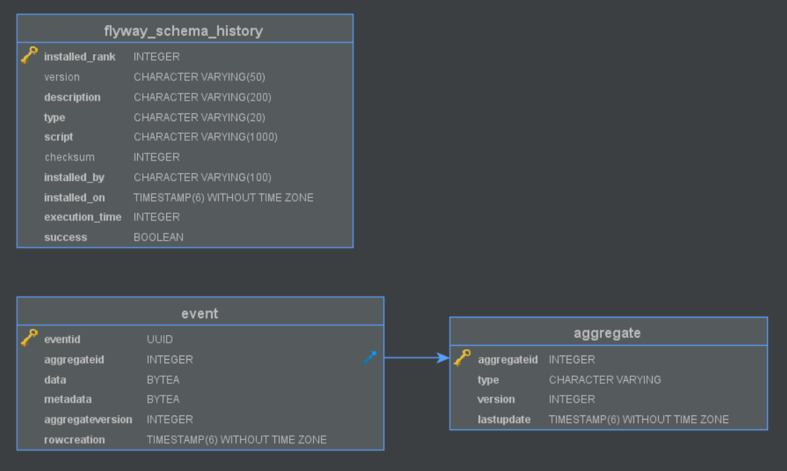

# sakila-store-write-service

The store-write microservice of the `sakila-microservices` system. This service
manages the `sakila_store_write` database and exposes the data through a RESTful 
API and publishes data change events to `Kafka` streams.

This is the write component of the logical "sakila-store-service". This database 
acts as the event store of the logical service. The service API defines only 
write operations in the form of commands. Each accepted command generates an 
event which is stored in the event store and published to a `Kafka` stream. 
Event messages contain the constructed entity at the given event state.
The `sakila-store-read-service` listens for these messages and directly updates
its data accordingly.

## Structure

```
src
├── main
│   ├── java
│   │   └── com
│   │       └── example
│   │           └── sakila
│   │               ├── application         ## Application entrypoint
│   │               ├── config              ## Cors, EventBus, Kafka config
│   │               ├── discovery           ## Registered instances controller
│   │               ├── event               ## Event model, service, publishing
│   │               │   ├── bus             ## Custom event bus implementation
│   │               │   └── store           ## EventStoreItem model, repository interface & implementation
│   │               ├── exception           ## Custom exceptions and @ControllerAdvice exception handlers
│   │               └── module
│   │                   ├── staff           ## Staff model, service (used to apply events)
│   │                   │   ├── command     ## Staff command handling
│   │                   │   │   └── model   ## Staff command models
│   │                   │   ├── event       ## Staff event publishing
│   │                   │   │   └── model   ## Staff event models
│   │                   └── store           ## Store model, service (used to apply events)
│   │                       ├── command     ## Store command handling
│   │                       │   └── model   ## Store command models
│   │                       └── event       ## Store event publishing
│   │                           └── model   ## Store event models
│   └── resources                           ## Application property files
│       └── db
│           └── migration                   ## Database migration files
└── test
    └── java
        └── com
            └── example
                └── sakila
                    ├── event               ## Event service, publisher tests
                    └── module
                        ├── staff
                        │   └── command     ## Staff command handling tests
                        └── store
                            └── command     ## Store command handling tests
```


#### Database schema



## Technology stack

The application is based on `Spring Boot`, written in `Java`. Testing is done with 
`Groovy`, using the `Spock Framework`. The connection to the database is done with 
`JDBC`

The API code is generated using the `swagger-codegen-maven-plugin`. The connection 
to the `Kafka` cluster is done using `spring-kafka`.

The service can scale horizontally, this is done by registering running instances 
in the `Eureka` cluster using the `spring-netflix-eureka-client`.

The database schema is wholly managed by the service using `Flyway`. For each of 
the tables there is also a script which writes the initial state.

The build process is managed through `maven`

## Environment

The service is packaged into a `Docker` container using the Dockerfile in the root 
dir, which is used to build an image on top of `openjdk:8-jre-alpine`.


